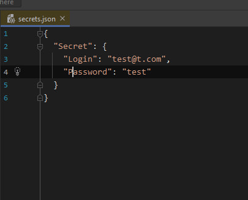

# NET Core User Secrets Rider plugin documentation

Small repo to show how to use NET Core User Secrets plugin for Rider IDE.

1) You need to [install the plugin](https://plugins.jetbrains.com/plugin/10183--net-core-user-secrets)

2) Navigate to your project -> right click -> Tools -> .NET User Secrets (You won't see the ".NET User Secrets" option without the plugin)

3) In the opened .json file you can define any secrets you want. Let's take login and password for example

4) Now you can use the secrets defined in the previous step in any way you want. You can access them by calling IConfiguration.GetValue<Т>(string key)

